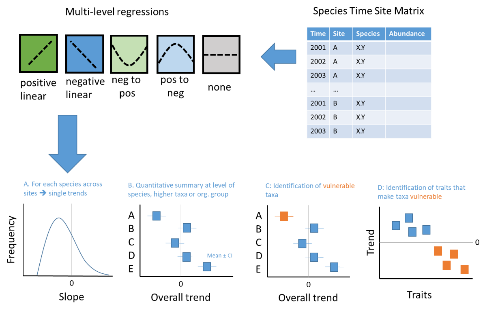
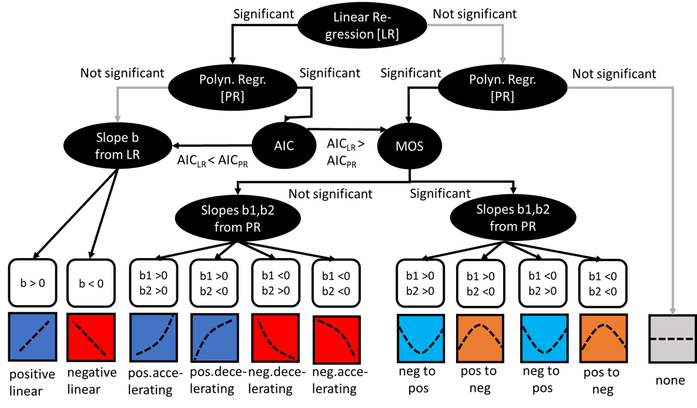

```{r setup, include=FALSE}
knitr::opts_chunk$set(echo = FALSE)
```

## 1. Introduction

The Wadden Sea is changing. Direct local human impacts such as dredging, fisheries and tourism coincide with regional stressors such as climate change and eutrophication. To understand the response of biota to these changes many projects and monitoring programs have gathered time series of communities. These data are mainly used to assess community wide metrics of biodiversity or to analyse population trends for certain species of interest. However, biodiversity metrics offer only a limited view on changes, as some only capture net changes (i.e. more immigrations than extinctions reflected by species richness), whereas others only reflect responses of dominant species. If, for example, all species would decline at the same rate without already going extinct, most biodiversity assessments would not pick that up. On the other hand, focusing on a subset of species may not capture the full range of population trends. There is a risk we are mainly focusing on extremes, i.e. species that are rapidly declining or have become dominant or even invasive. 

In order to gain a more comprehensive view of the shifts in Wadden Sea biodiversity, we need a systematic and quantitative overview of individual species trends. These can be used to identify winners and loosers under current and past environmental change by comparing the trend per species across locations. By aggregating at higher taxonomic levels such as orders, classes or phyla, we can ask whether certain groups are especially endangered profiting, which also can enable addressing vulnerability. In the first approach, we will focus on simply analysing the trends per species, but in later iterations of the synthesis we can also compare this to potential drivers and co-dependencies between species (e.g. in a trophic context). 

## 2. Workflow

Raw data are species-time-site data (Fig. 1, top right), i.e, observations of abundance or biomass per species per year at a repeatedly sampled site. For the purpose of this analysis, it is not useful to take seasonal changes into account, so the idea is to use annual mean values of abundance or biomass in those cases where multiple samples were done per year. There might be cases where the coverage of the year has changed, when e.g. initially only high biomass seasons were sampled, but later also winter samples were included. This would reduce the mean even when the season-specific samples were unchanged. Therefore, we will carry the information on how many samples were used per year with us in the forthcoming analyses. The minimum information just comprises a variable "StationID" that names the site of observation, "year" as a numeric format, "species" for the species name and "abu" for the abundance of the biomass. Please see under "3. Analyses" which steps can be taken to conform to this standard if variable names differ, the data is not on a yearly basis or the data are in wide format with species being in different columns.



Population trends can be linear or non-linear of different polynomial orders (Fig. 1, top left). As we want to synthesize across species and phyla, I suggest to limit the polynomial to second order. This captures four general types of trends (next to the fifth case of "no trend"), a monotonic increase or decrease or a trend reversal from positive to negative or vice versa. To capture these trends, we will run linear and unimodal regressions on the abundance (abu, might also be biomass if this is the preferred response variable) of each species i at station j with year as the only predictor.

$$
abu = a + b * year
$$
$$
abu = a + b * year + c * year^2
$$
These will be compared using Akaike Information Criteria (AIC) and the MOS test (Mitchell-Olds & Shaw 1987). A unimodal trend is only a valid observation if three conditions apply: 

i) the polynomial is the more parsimonious model, i.e. has a lower AIC than the linear model

ii) the parameters b and c have different signs  

iii) the mode (time point of trend reversal) is in the time of observations, i.e. between the minimum and maximum year covered. 

To be precise, if (i) is not true, a linear or no trend is observed. If (i) applies, but (ii) not, an accelerating trend is observed (positive when b and c are positive, negative when b and c are negative). In these cases, the slope changes with time, but the trend remains monotonic and shows no reversal of sign. If (i) and (ii) apply, but (iii) is not give, we observe decelerating trends, where depending on signs of b and c, we observe positive or negative trends that slow down. Figure 2 is an illustration of all possible cases in this decision tree



For each unique combination of species and site, we will extract the information on the parameters a, b (and c) for linear and polynomical regressions together with their standard errors, plus the AIC, explained variance (R²) and significanc levels. Based on the decision tree in Fig. 2, we will use either the linear or nonlinear slopes for a weighted meta-analysis that as first step gives the average trend of species i across sites. We can analyse the overall distribution of these trends (Fig. 1, bottom panels), how much of the heterogeneity of the trends can be explained by functional groups, phylogeny or location.   

## 3. Analyses

### Install libraries
```{r, echo = TRUE, message=FALSE}
library(tidyverse)
library(vegan)
library(reshape2)
library(lubridate)
library(broom)
```

### Explanatory case

As an explanatory case we are using the phytoplankton monitoring data from Lower Saxony and the Netherlands that were assembled during a recent EU Interreg Project. The data is ideal as it allows checking a number of potential caveats that might also occur in other data 


```{r echo = TRUE, message=FALSE}
data <- read_delim("data/PPKTcount_noHT_28092022.csv", 
    delim = ";", escape_double = FALSE, trim_ws = TRUE)
names(data)

```

Each of the following steps needs only to be done when required. They lead to the requested output for the actual analysis. 


```{r echo = TRUE, message=FALSE}

# STEP 1: If your variable names do not conform to our standard (StationID, year, species, abu), rename and delete empty rows 
data<-data %>% rename(species = Species, abu = biovolume_l) 
# in our case StationID is okay, year needs to be calculated
data<-data[!is.na(data$abu),]
data<-data[!is.na(data$sampledate),]

# STEP 2: If sample date but not year is given, extract the year. Library lubridate allows to first change the dates to numeric values and then extract the year
data$date.numeric<-dmy(data$sampledate) 
# dmy is command if data are in format dd.mm.yyyy, ymd is for yyyy.mm.dd
data$year <- year(data$date.numeric) 
# extracts the year

# STEP 3: If your data can contain the same species more than once per sample (because different size classes or lifestages were distinguished) sum them
data<-data  %>%
  group_by(StationID, sampledate, year, species) %>%  
  summarise(abu= sum(abu, na.rm = T))
# obviously sampledate and STEP 4 can be ignored if only annual data exist

# STEP 4: Create annual means and the number of annual samples 
data<-data  %>%
  group_by(StationID, year, species) %>% 
  summarise(abu= mean(abu, na.rm = T),
            N.sample=length(abu))

# STEP 5: Further reductions
# if you need to exclude some StationID because they are not part of the WaddenSea or for other reasons
data<-data %>%
  filter(StationID %in% c("BOOMKDP", "DANTZGT", "DOOVBWT","GROOTGND","BOCHTVWTM",
                        "HUIBGOT", "MARSDND", "ROTTMPT3", "TERSLG10",
                        "Nney_W_2", "Bork_W_1", "WeMu_W_1", "JaBu_W_1"))

# In other data sets it might be needed to exclude certain species or years.

# Our example is already in long format, if your data is in wide format consider the "melt" command as in mentioned here, remove inital # to run
#data <- melt(data, 
#                 id.vars=c("StationID", "year"), # all the variables to keep but not split apart
#                 measure.vars=c(x:y), # number of the variables containing species, that shall be melted into one
#                 variable.name="species", # name for new variable that contains the names of the melded variables
#                 value.name="abu") # name of the new variables with the values

```

Not all species are suitable for this type of analysis. A recurrent problem are rare species with infrequent recordings. In years in which they have not been recorded, their abundance potentially was not 0. Relying on a few data points interspersed over a longer period increases the risk of finding significant but wrong trends. At the same time, replacing absences by zeros skews the population trends towards neutral. A generic solution can be to limit the analyses to species which have recordings for a threshold number of years (suggested here: >75%) and a minimum number of years (suggested here 5 years). 

```{r echo = TRUE, message=FALSE}
length.spec <-data %>% 
  group_by(StationID, species) %>% 
  summarise(N.spec=length(unique(year)))

length.stat <-data %>% 
  group_by(StationID) %>% 
  summarise(N.stat=length(unique(year)))
length<-merge(length.spec,length.stat,by="StationID")
length$threshold<-length$N.spec/length$N.stat
data<-merge(data,length,by=c("StationID","species"))

data<-data[data$N.spec>4,]
data<-data[data$threshold>.75,]
```

The following code now runs the regressions and extracts the relevant information from the regessions and merges them. I use log-transformed abundance here

```{r echo = TRUE, message=FALSE}
#get slope b of LN(abu) ~ year from linear regression

results.logabu = data %>% 
  group_by(StationID, species) %>% 
  do(tidy(lm(log(abu)~year, data = .)))%>% 
  filter(term == "year")
results.logabu<-results.logabu %>% rename(b.linear = estimate,
                                      SE.b.linear = std.error,
                                      pval.lin = p.value)

results.logabu<-results.logabu[,c("StationID","species","b.linear","SE.b.linear", "pval.lin")]
glance.logabu = data %>% 
  group_by(StationID, species) %>% 
  do(glance(lm(log(abu)~year, data = .))) 
glance.logabu<-glance.logabu %>% rename(AIC.linear = AIC,
                                      nobs.linear = nobs,
                                      r2.lin = adj.r.squared)

glance.logabu<-glance.logabu[,c("StationID","species","AIC.linear","nobs.linear","r2.lin")]
results.logabu<-merge(results.logabu,glance.logabu, by=c("StationID","species"))

results.year = data %>% 
  group_by(StationID, species) %>% 
  summarize(min.year=min(year),
            max.year=max(year))

results.logabu<-merge(results.logabu,results.year, by=c("StationID","species"))

#get slope b of LN(abu) ~ poly (year,2) from quadratic regression

results.logabu2.lin = data %>% 
  group_by(StationID,species) %>% 
  do(tidy(lm(log(abu)~poly(year,2), data = .)))%>% 
  filter(term == "poly(year, 2)1") 
results.logabu2.lin<-results.logabu2.lin %>% rename(b.poly = estimate,
                                                SE.b.poly = std.error,
                                                pval.b.poly = p.value)

results.logabu2.lin<-results.logabu2.lin[,c("StationID","species","b.poly","SE.b.poly", "pval.b.poly")]

#get slope c of LN(abu) ~ poly (year,2) from quadratic regression
results.logabu2.quad = data %>% 
  group_by(StationID,species) %>% 
  do(tidy(lm(log(abu)~poly(year,2), data = .)))%>% 
  filter(term == "poly(year, 2)2") 

results.logabu2.quad<-results.logabu2.quad %>% rename(c.poly = estimate,
                                                  SE.c.poly = std.error,
                                                  pval.c.poly = p.value)


results.logabu2.quad<-results.logabu2.quad[,c("StationID","species","c.poly","SE.c.poly", "pval.c.poly")]

glance.logabu2 = data %>% 
  group_by(StationID,species) %>% 
  do(glance(lm(log(abu)~poly(year,2), data = .)))
glance.logabu2<-glance.logabu2 %>% rename(AIC.poly = AIC,
                                    nobs.poly = nobs,
                                    r2.poly = adj.r.squared,
                                    pval.poly = p.value)

glance.logabu2<-glance.logabu2[,c("StationID","species","AIC.poly","nobs.poly","r2.poly","pval.poly")]

results.logabu2<-merge(results.logabu2.lin,results.logabu2.quad, by=c("StationID","species"))
results.logabu2<-merge(results.logabu2,glance.logabu2, by=c("StationID","species"))


#merge linear and quadratic regression
output<-merge(results.logabu,results.logabu2, by=c("StationID","species"))

```

In order to categorize the species trends according to Figure 2, we create a new variable "vote" and fill it according to criteria i and ii (iii follows in the next step). We need to discuss which significance level we want to use for benchmarking (suggested here p = 0.1). 

```{r echo = TRUE, message=FALSE}
#create the votes according to Figure 2

output$vote<-NA
# none of the regressions is significant
output$vote[output$pval.lin>=0.1 & output$pval.poly>=0.1]<-"no"
# only linear is significant
output$vote[output$pval.lin<0.1 & output$pval.poly>0.1 &
                   output$b.linear<0]<-"negative linear"
output$vote[output$pval.lin<0.1 & output$pval.poly>0.1 &
                   output$b.linear>0]<-"positive linear"

# only quadratic is significant
output$vote[output$pval.lin>0.1 & output$pval.poly<0.1 &
                   output$b.poly<0 & output$c.poly<0]<-"negative accelerating"
output$vote[output$pval.lin>0.1 & output$pval.poly<0.1 &
                   output$b.poly>0 & output$c.poly>0]<-"positive accelerating"
output$vote[output$pval.lin>0.1 & output$pval.poly<0.1 &
                   output$b.poly<0 & output$c.poly>0]<-"negative to positive"
output$vote[output$pval.lin>0.1 & output$pval.poly<0.1 &
                   output$b.poly>0 & output$c.poly<0]<-"positive to negative"

#both are significant, requiring involving AIC, first if AIC is lower for the polynomial
output$vote[output$pval.lin<0.1 & output$pval.poly<0.1 &
                   output$AIC.linear>output$AIC.poly & output$b.poly<0 & output$c.poly<0]<-"negative accelerating"
output$vote[output$pval.lin<0.1 & output$pval.poly<0.1 &
                   output$AIC.linear>output$AIC.poly & output$b.poly>0 & output$c.poly>0]<-"positive accelerating"
output$vote[output$pval.lin<0.1 & output$pval.poly<0.1 &
                   output$AIC.linear>output$AIC.poly & output$b.poly<0 & output$c.poly>0]<-"negative to positive"
output$vote[output$pval.lin<0.1 & output$pval.poly<0.1 &
                   output$AIC.linear>output$AIC.poly & output$b.poly>0 & output$c.poly<0]<-"positive to negative"
# same but when AIC is lower for linear regression
output$vote[output$pval.lin<0.1 & output$pval.poly<0.1 &
                   output$AIC.linear<output$AIC.poly & output$b.linear<0]<-"negative linear"
output$vote[output$pval.lin<0.1 & output$pval.poly<0.1 &
                   output$AIC.linear<output$AIC.poly & output$b.linear>0]<-"positive linear"
output$vote[output$pval.lin<0.1 & is.na(output$pval.poly) &
                   output$b.linear<0]<-"negative linear"
output$vote[output$pval.lin<0.1 & is.na(output$pval.poly) &
                   output$b.linear>0]<-"positive linear"

#sometimes, the polynomial or even the linear do not produce results, such that the p-value is NA, make these neutral trends as well
output$vote[is.na(output$vote) & output$pval.lin>0.1 & is.na(output$pval.poly)]<-"no"
output$vote[is.na(output$vote) & is.na(output$pval.lin)] <-"no"

```

The MOS test is part of the vegan package, it only needs to be done on the votes that passed criteria i and ii. 

```{r echo = TRUE, message=FALSE}
#create a unique case identifier
output$UCI<-paste(output$StationID,output$species) 
data$UCI<-paste(data$StationID,data$species) 
UCI<-unique(output$UCI[output$vote=="negative to positive"|
                                    output$vote=="positive to negative"])

# as there might be cases when there is no such case, i do the loop as in if-else clause
if(length(UCI)>0){
  MOS.logabu<-data.frame()
  for(i in 1:length(UCI)){
    temp<-data[data$UCI==UCI[i], ]
    if(dim(temp)[1]>2){
      MOS<-MOStest(temp$year,log(temp$abu))
      MOSout<-MOS$isBracketed
      MOS.logabu<-rbind(MOS.logabu,data.frame(UCI=temp$UCI[1],MOSout))
      rm(temp)
    }
  }
} else{
  MOS.logabu<-data.frame(matrix("", ncol = 1, nrow = dim(output)[1]))
  MOS.logabu$UCI<-output$UCI
  MOS.logabu$MOSout<-NA}


output<-merge(output,MOS.logabu,by="UCI",all=T)

# change votes if MOS Test was FALSE

output$vote[output$vote=="positive to negative" &
                   output$MOSout=="FALSE"]<-"positive decelerating"
output$vote[output$vote=="negative to positive" &
                   output$MOSout=="FALSE"]<-"negative decelerating"

summary(as.factor(output$vote))

```


### Meta-information to be used for synthesis


```{r echo = TRUE, message=FALSE}

# Information on the data set
#output$organism.group <-"phytoplankton"
#output$datasource <- "NLWKN RWS"
#output$addition <- "Helmut Hillebrand"
#output$measured.variables <- "biovolume"

#taxonomy

#latlong

```


## Literature

Mitchell-Olds T. & Shaw R.G. (1987). Regression Analysis of Natural Selection: Statistical Inference and Biological Interpretation. Evolution, 41, 1149-1161